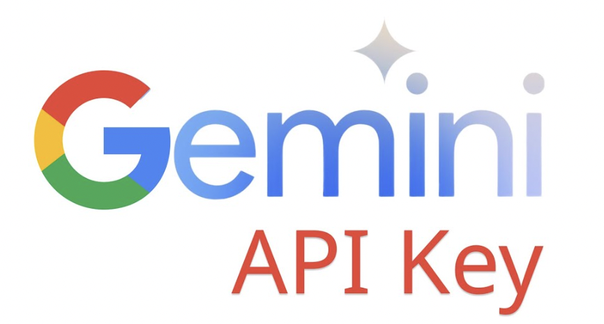
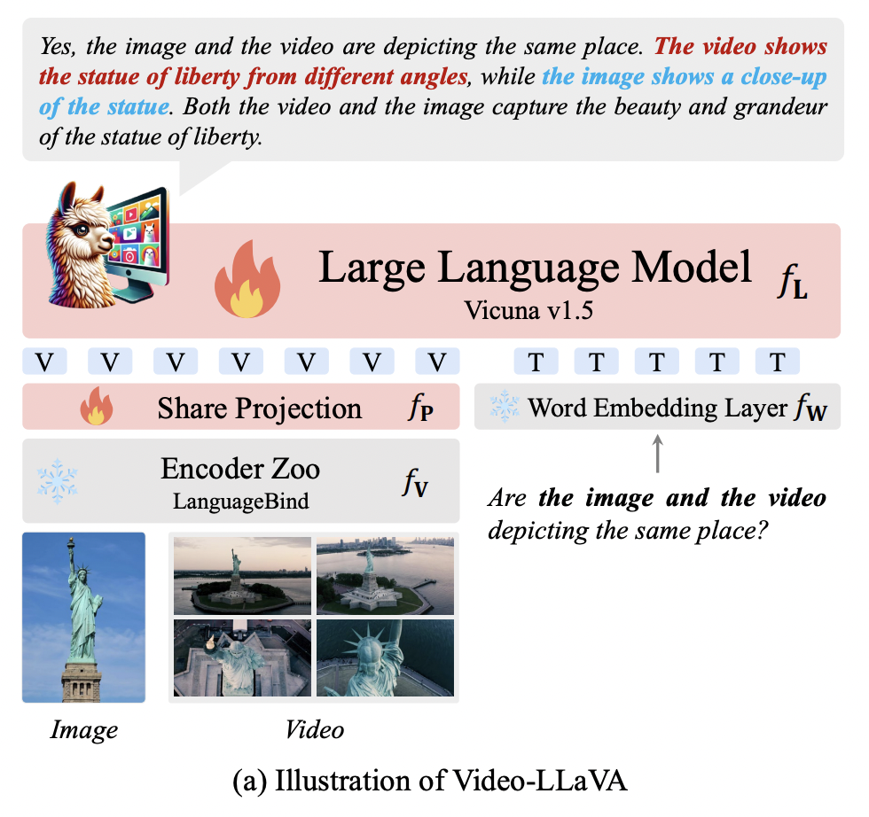
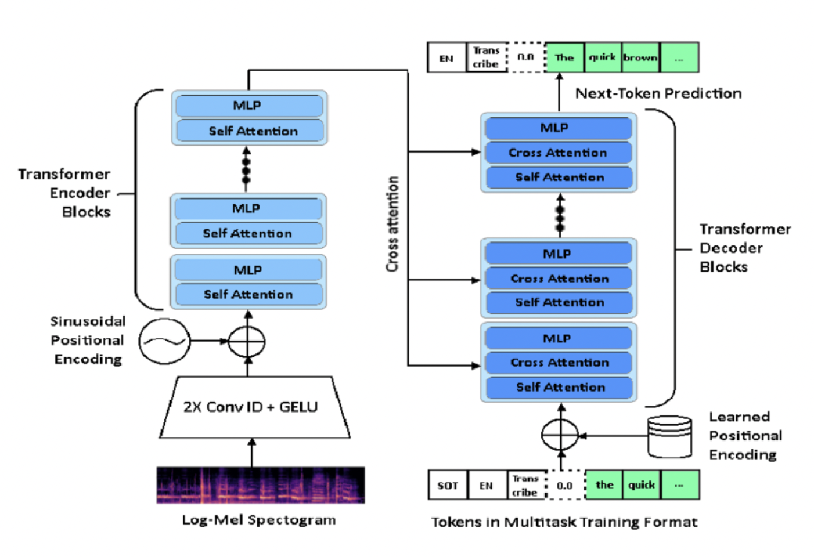
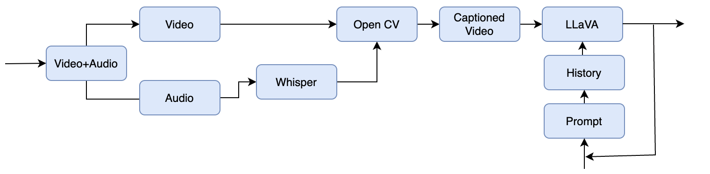

# Video Question Answering System - CV Track

## Problem Statement
Develop a system capable of analyzing videos and answering user queries based on the content.

---
ONE SIMPLE SOLUTION

---

## Approach
We began by leveraging **Video LLaVA** to process videos and answer related questions.

### Advantages of Using Video LLaVA:
1. **Video Content Analysis**: LLaVA efficiently extracts and processes key frames from a video to understand its visual content, capturing crucial details while maintaining computational efficiency.
2. **Multimodal Question Answering**: Integrates vision and language capabilities to answer user queries about the video based on analyzed frames and temporal context.
3. **Dynamic Summarization**: Generates concise descriptions or summaries of videos, considering both static elements and dynamic sequences over time.

### Challenges Faced:
- **Lack of Audio Processing**: LLaVA was unable to process the audio component of videos, limiting its ability to answer queries dependent on spoken content.

---

## Transition to Whisper
To overcome the audio processing limitation, we integrated **Whisper**, a powerful transcription model, into our pipeline.

### Advantages of Using Whisper:
1. **Multilingual Support**: Provides transcription and translation in multiple languages, catering to diverse global audiences.
2. **High Accuracy**: Leverages OpenAI's advanced language models to deliver accurate transcription, especially for clear audio.
3. **Robustness**: Handles diverse accents, background noise, and varying audio qualities, ensuring reliable performance in real-world scenarios.

---

## Our Approach

### Combined Workflow

1. **Video Frame Analysis**: Used Video LLaVA to extract and analyze key frames for visual context.
2. **Caption Generation**: Added captions to the video using Whisper to transcribe the audio content.
3. **Timestamped Captions**: Provided time-stamped captions as input prompts to enhance the understanding of video sequences.

### Addressing Context Limitations
Initially, LLaVA struggled to maintain conversational context, which hindered the generation of coherent answers for longer interactions. We resolved this by:
1. **Prompt Engineering**: Maintained a history of interactions by recording all conversations in a structured format.
2. **Transformer Integration**: Fed the conversation history into transformers, enabling the model to generate contextually relevant responses by building on prior exchanges.

This iterative approach allowed us to successfully handle context-dependent queries and generate coherent answers, enhancing the overall user experience.

---

## Conclusion
Our combined system of Video LLaVA and Whisper effectively processes both visual and audio content, enabling comprehensive video analysis and answering diverse user queries. By employing advanced prompt engineering and context management, we achieved a robust solution for the Video Question Answering problem.

## Video
<a href="https://drive.google.com/file/d/1mJgeGw1sNkyqqNQ0shs62JiU3lOvhCfe/view?usp=drive_link">For Gemini</a>

<a href="https://drive.google.com/file/d/1pnMeLYRXYkOYDKKKVECZLhf3GOEIBUSt/view?usp=drive_link">For Video-LlaVa</a>
